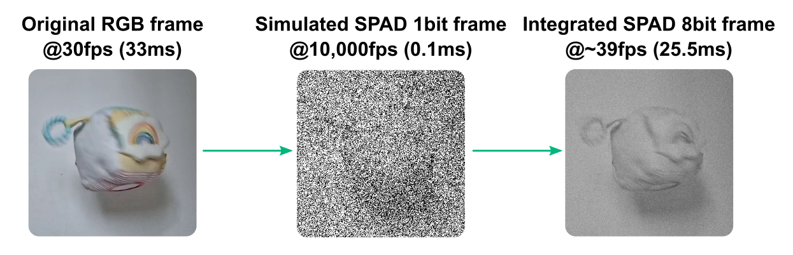
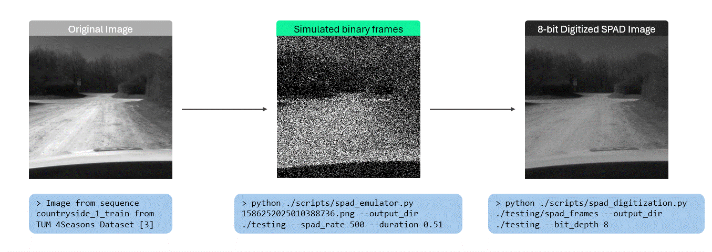

# spadSim - Simulating and digitizing SPAD frames <!-- omit in toc -->

This is a small weekend hack (now turned into a multi-week project) where I've built a couple of tools to simulate and digitize SPAD-style binary photon frames. The simulator converts ordinary RGB videos into realistic 1-bit SPAD frames using optical flow and poissonian statistics. The digitization tool converts sequences of 1-bit SPAD frames into higher bit-depth images by summing detections. There's plenty of room for improvement (see [this section](#potential-future-implementations) as a reference) but works nicely as is. See and test for yourself 👇




>📢**Updates:**
> - (15 Mar 2026) Added `spad_digitization.py` script to digitize 1-bit SPAD frames into higher bit-depth images by summing consecutive frames.
> - (15 Mar 2026) Now you can also input a single RGB image file and generate a given number of SPAD frames based on `--spad_rate` and `--duration`.
> - (14 Mar 2026) You can also input a directory containing already extracted or existing RGB images.
> - (2025-Dec-02) Demo uploaded.
> - (2025-Nov-30) Repository creation.

## Contents <!-- omit in toc -->
- [Quick setup](#quick-setup)
- [What the simulator does](#what-the-simulator-does)
- [Imaging Model](#imaging-model)
  - [1. Computing photon flux from RGB 8-bit pixel intensity](#1-computing-photon-flux-from-rgb-8-bit-pixel-intensity)
  - [2. Optical Flow Interpolation](#2-optical-flow-interpolation)
  - [3. Photon Arrivals (Poisson)](#3-photon-arrivals-poisson)
  - [4. Binary Detection (Thresholding)](#4-binary-detection-thresholding)
- [Script input parameters](#script-input-parameters)
- [Example](#example)
- [Diagnostics](#diagnostics)
- [SPAD Digitization](#spad-digitization)
- [References](#references)
- [Licensing](#licensing)
- [Potential future implementations](#potential-future-implementations)

## Quick setup

### 1. Clone repo <!-- omit in toc -->
```
git clone https://github.com/drodriguezSRL/spadSim
```

### 2. Install dependencies <!-- omit in toc -->
```
pip install numpy opencv-python pillow tqdm
```

### 3. Run a quick demo of the simulator <!-- omit in toc -->

Using a **video** as an input:
```
python ./scripts/spad_emulator.py ./testing/demo.mp4 --output_dir testing
```

You can also run the script using a **directory of pre-extracted RGB frames**:
```
python ./scripts/spad_emulator.py ./testing/rgb_frames --output_dir testing
```

Or using a **single RGB image**:
```
python ./scripts/spad_emulator.py ./testing/single_image.png --output_dir testing --spad_rate 100 --duration 2.0
```

### 4. Explore the results <!-- omit in toc -->
Inside `testing/` you will find:

- `rgb_frames/` → extracted RGB video frames
- `spad_frames/` → simulated binary SPAD frames
- `metadata.json` → simulation parameters
- `diagnostics.json` → photon/detection statistics

### (Optional) Access the docstring <!-- omit in toc -->
The code is fully documented. You can access the docstring with:
```
python -c "import scripts/spad_emulator; help(spad_emulator)"
```
or using `pydoc`:
```
python -m pydoc scripts/spad_emulator
```
---

## What the simulator does

This repository contains `spad_emulator.py`, a script that simulates the acquisition of **binary Single-Photon Avalanche Diode (SPAD)** frames using a standard RGB video, directory of RGB images, or single RGB image as a reference input.

The SPAD simulator models photon arrivals using poissonian statistics and simulates the ultra-fast frame rates of a SPAD by interpolating motion between the extracted RGB frames using dense optical flow (for video/directory inputs), or by generating multiple frames from a single image.

A SPAD camera operates differently from conventional CMOS/CCD imaging sensors. SPADs record binary frames (1-bit per pixel output) based on the detection of a single photon per pixel (0: no photon, 1: photon) at ultra-fast speeds (up to 100kfps, µs-exposure per frame). For more information about SPADs and how they compare to conventional cameras, I encourage you to read [[1]](https://arxiv.org/abs/2510.10597).

This simulator emulates SPAD imaging by:

1. Extracting RGB frames from an input video, loading RGB images from a directory, or using a single RGB image
2. Estimating the photon flux in the image
3. Interpolating motion between RGB frames using optical flow (for multi-frame inputs) or generating static frames (for single image)
4. Simulating Poisson photon arrivals
5. Thresholding detections to generate a sequence of binary frames

## Imaging Model

### 1. Computing photon flux from RGB 8-bit pixel intensity

One of the first things we need to model is the photon flux; i.e., the total number of photons arriving to each pixel at any given time. Ideally, we should estimate the total number of photons emitted by a scene per second. This way the photon flux could be calculated by simply dividing this number by the pixel active surface area. However, estimating total photon emissions in a scene is non-trivial. Instead, I have simplified this estimation via **photon-count scaling** by first normalizing the intensity values of each pixel (`I(x,y)`) in the RGB frames:

```math
i(x,y) = I(x,y) / 255
```

And then defining a high-level, user-defined parameter called `rgb_photons` that represents how many signal photons are collected by a single pixel during a full RGB exposure when that pixel is fully saturated (i.e., `i=1` or `I=255`). This way the user can control and define the overall brightness of the scene. The default value for this parameter is set as `PHOTONS_PER_PX = 1000`.

>[!IMPORTANT]
> This is a huge simplification, heavily dependent on the light sensitivity of the RGB camera used to record the input source. Scene features that aren't captured by the RGB camera (e.g., clipped shadows and highlights) won't show up in the binary frames, even if, in reality, a SPAD camera may be capable of resolving those same features due to its enhanced sensitivity. Same will happen to image artifacts, such as motion blur. Anything affecting the original frames will invariably affect the generated SPAD images.

The maximum photon flux is then defined by:

```math
\phi_{max} = \frac{\text{rgb-photons}}{t_{rgb}},
```
where $$t_{rgb}$$ is the exposure time per frame of the input source (video or extracted frames).

Given $$i(x,y)$$ and $$\phi_{max}$$, the photon flux per pixel (photons/sec) can be computed by:

```math
\phi(x,y) = i(x,y) \cdot \phi_{max} =i(x,y)\cdot \frac{\text{rgb-photons}}{t_{rgb}}
```
### 2. Optical Flow Interpolation

SPAD cameras are often multiple orders of magnitude faster than conventional cameras. To simulate this capability, multiple in-between frames need to be created per RGB image pair.

For this, I have implemented dense optical flow based on the [OpenCV implementation of the Gunnar Farnebäck algorithm](https://docs.opencv.org/3.4/d4/dee/tutorial_optical_flow.html) to estimate motion between two consecutive frames and interpolate new binary frames at intermediate times. Unlike sparse optical flow methods (e.g., Lukas-Kanade), Farnebäck's method [[2]](https://link.springer.com/chapter/10.1007/3-540-45103-X_50) computes the optical flow for all pixels in the frame.

The creation of intermediate frames is done in two steps.

1. Compute the flow field between the grayscale versions of two consecutive RGB frames.
2. Perform motion-aware image interpolation by warping a version of the original images shifted along the motion vectors by a fraction `alpha` of the total movement
    - `alpha` = 0 -> output = original frame
    - `alpha` = 1 -> output = next frame according to the flow field
    - `alpha` = 0.5 -> halfway between the two frames (motion-interpolated)

`alpha` is computed based on the ratio of SPAD-to-RGB frames. Warping is done both ways, from imgA -> imgB and vice versa (reverse flow, in this case warped by `alpha-1`). Both warped versions are then blended to yield a spatially coherent intensity field per SPAD frame time.

```math
I_{blended}(t) = (1 - \alpha ) A_{warp} + \alpha B_{warp}
```

>[!NOTE]
> Currently, only Farnebäck's method is available. Other methods could be implemented (tbd).

### 3. Photon Arrivals (Poisson)

The arrival of photons at a single SPAD pixel can be modeled by a **Poisson distribution**, where the probability of a number of photons, $$k$$, reaching a pixel within an exposure window is given by:

```math
P(x=k) = \frac{\lambda^k e^{-\lambda}}{k!}.
```
$$\lambda$$ defines the expected number of photons and mathematically is defined by the photon flux, $$\phi$$, the quantum efficiency of the SPAD sensor, $$\eta$$ (`SPAD_QE` in the script, with a default value of `0.5`), and the exposure time, $$t_{spad}$$:

```math
\lambda_{signal} =  \phi \cdot \eta \cdot t_{spad} = i(x,y)\cdot \text{rgb-photons}\cdot \eta \cdot \frac{t_{spad}}{t_{rgb}}.
```

An additional effect due to dark counts (false detections of photons due to thermal noise) can be included by computing:

```math
\lambda_{dcr} = DCR \cdot t_{spad}.
```

>[!NOTE]
> A specific parameter is used to set whether dark counts should be taken into account when computing the expected number of photons per pixel: `INCLUDE_DCR`, currently set to `False`. Another parameter, `SPAD_DCR`, is used to define the average expected number of counts per second of a given SPAD sensor.

With this, the total expected number of photons is defined by:

```math
\lambda = \lambda_{total} = \lambda_{signal} + \lambda_{dcr}
```

For every pixel and every SPAD frame, the number of actual striking photons is defined by a random number drawn from the Poisson distribution with mean $$\lambda$$. This is a random number (stochastically sampled) and represents the number of photons detected during that SPAD exposure interval.

#### Typical SPAD operation regimes <!-- omit in toc -->

| $$\lambda_{signal}$$ | Regime   | Meaning |
|----------------------|----------|---------|
| 0.001 - 0.02 | Extremely low light | Almost no detections |
| 0.02 - 0.2 | Photon-limited | Good for SPAD experiments |
| 0.2 - 1.0 | Medium light | Increased detections |
| > 1.0 | Bright light | Nearly always detects a photon |

### 4. Binary Detection (Thresholding)

SPADs are single-photon sensitive, which means they only need to detect a single photon to trigger an avalanche in the semiconductor and be digitally registered.

A SPAD pixel outputs, therefore, a value of 1 if $$n\geqslant 1$$ and a value of 0 otherwise.

## Script input parameters

A number of command-line arguments can be used when running the `spad_emulator.py` script. The first (positional) argument is the input source, which can be either:

- A path to an RGB video file (e.g. `input.mp4`)
- A path to a directory containing RGB PNG images (e.g. `./rgb_frames/`)
- A path to a single RGB image file (e.g. `image.png`)

| Argument | Short | Description | Default |
|----------|-------|-------------|---------|
| `input` | n.a. | Input video file or directory of RGB PNG images | n/a |
| `--output_dir` | `-o` | Output directory | `\output_dir` |
| `--rgb_fps` | `-f` | Frame extraction rate / assumed input frame rate | `DEFAULT_FPS`=30 |
| `--max_frames` | `-m` | Limit RGB frames | None |
| `--spad_rate` | `-sf` | SPAD frame rate | `SPAD_FPS`=100 |
| `--rgb_photons` | `-p` | Photons per RGB exposure at intensity=1 | `PHOTONS_PER_PX`=1000 |
| `--quantum_efficiency` | `-qe` | Quantum efficiency | `SPAD_QE`=0.5 |
| `--include_dcr` | `-id`| Enable dark counts? | `INCLUDE_DCR`=False |
| `--dcr` | `-d` | Dark counts per second | `SPAD_DCR`=100 |
| `--detection_threshold` | `-dt` | Photon threshold | `DETECTION_THRESHOLD`=1 |
| `--optical_flow_method` | `-ofm`| Optical flow method | `OPTFLOW_METHOD`=`farneback`|
| `--save_rgb` | `-s`| Save extracted RGB (copy from input directory) | `SAVE_RGB`=True|
| `--seed` | n.a. | RNG seed | `SEED`=0 |
| `--duration` | n.a. | Duration in seconds for single image input | 1.0 |

The value of these arguments, including exposure times for both RGB and SPAD frames, are saved after execution in a `metadata.json` file in the same output directory.

## Example

```
python spad_emulator.py input.mp4 --output_dir ./testing --spad_rate 10000 --include_dcr 1 --dcr 150
```

## Diagnostics

For sanity checking after processing each RGB pair into SPAD frames, the following will be computed and saved in a `diagnostics.json` file:

- Pair index
- Mean signal photon rate $$\lambda_{signal}$$ across all pixels and SPAD frames: averaged expected number of detected photons before thresholding per pixel for one SPAD exposure
- Mean dark count rate $$\lambda_{dark}$$ (if enabled)
- Mean total $$\lambda$$
- Empirical mean detection probability per pixel, $$P(x=1)$$: actual fraction of pixels that fire in the binary frame

>[!NOTE]
>The detection probability is based on the poisson statistics previously defined:
>
>```math
>P(x = 1) = 1 - e^{-\lambda} = 1 - e^{-\left( i(x,y)\cdot \text{rgb-photons}\cdot \eta + DCR \right) \frac{t_{spad}}{t_{rgb}}}
>````

These numbers help verify if the photon-count scaling (brightness-to-photon mapping and `rgb_photons` value) produce reasonable detection rates.

### Troubleshooting with the diagnostics <!-- omit in toc -->

| Problem | Symptoms | Potential fix |
|---------|----------|---------------|
| Frames to dark (mostly zeros) | $$\lambda_{signal}\lt 0.02$$, & $$P(x=1)\lt 5\% $$ | Increase `rgb_photons` or decrease `spad_rate` |
| Frames too bright (mostly ones) | $$\lambda\gt 0.5$$, & $$P(x=1)\gt 40\% $$ | Decrease `rgb_photons` or increase `spad_rate` |
| Dark noise dominates |$$\lambda_{dark}\simeq \lambda_{signal}$$ | increase `spad_rate` |

## SPAD Digitization

This repository also contains `spad_digitization.py`, a script that digitizes sequences of 1-bit SPAD frames into higher bit-depth images by summing consecutive frames.

The digitization process groups SPAD frames into chunks of size (2^bit_depth - 1) and sums the binary detections pixel-wise to create grayscale images. For example, with bit_depth=8, every 255 SPAD frames are summed to produce an 8-bit image where pixel values range from 0 (no detections) to 255 (all detections).



### Quick digitization setup <!-- omit in toc -->

1. Run the digitization script on a directory of SPAD frames:
```
python ./scripts/spad_digitization.py ./testing/spad_frames --output_dir digitized_output --bit_depth 8
```

### Digitization parameters <!-- omit in toc -->

| Argument | Short | Description | Default |
|----------|-------|-------------|---------|
| `input_dir` | n.a. | Input directory with 1-bit SPAD PNGs | n/a |
| `--output_dir` | `-o` | Output directory for digitized images | `./output_digitized` |
| `--bit_depth` | `-b` | Target bit depth (e.g., 8) | 8 |

The script saves digitized images as `digitized_XXXXXX.png` and a `metadata.json` with processing details.

## References
- [[1]](https://arxiv.org/abs/2510.10597) Fast Vision in the Dark: A Case for Single-Photon Imaging in Planetary Navigation
- [[2]](https://link.springer.com/chapter/10.1007/3-540-45103-X_50) Two-Frame Motion Estimation Based on Polynomial Expansion
- [[3]](https://cvg.cit.tum.de/data/datasets/4seasons-dataset) 4Seasons Dataset: A Cross-Season Dataset for Multi-Weather SLAM in Autonomous Driving

## Licensing
[MIT](LICENSE.txt)

## Potential future implementations
- [x] record demo
- [ ] (tbd) test other optical flow methods (e.g., RAFT)
- [ ] preprocess rgb frames (e.g., deblurred)
- [ ] dead time modeling
- [ ] afterpulsing
- [ ] fill-factor models
- [x] bit-packed outputs (digitization script added)
- [x] save_rgb flag
- [ ] crop SPADs to match resolution
- [x] no rgb_fps input, use video's own fps not default
- [ ] implement radiometric model for photon flux estimation instead of rgb_photons
- [x] support input as directory of RGB images
- [x] support single RGB image input


